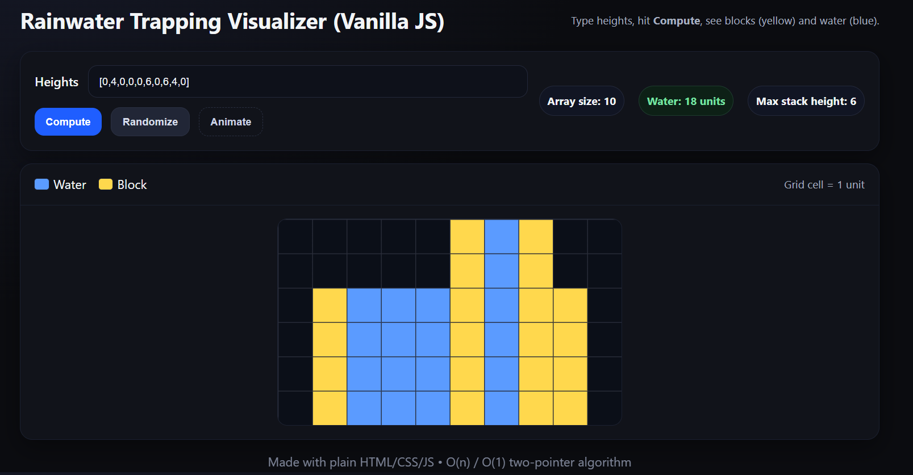

I built you a single-file Vanilla JS app:

lets you enter any heights array (e.g., [0,4,0,0,0,6,0,6,4,0]),

computes trapped water in O(n) using the two-pointer method,

and renders a clean grid with blocks (yellow) and water (blue) on a responsive canvas, plus an optional fill animation.
